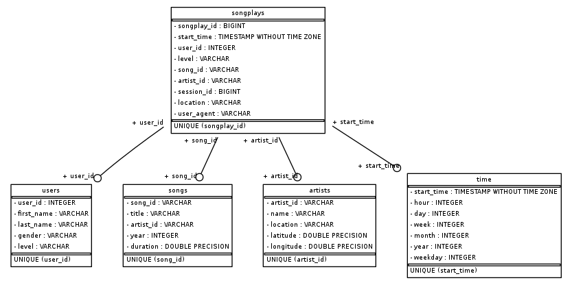

# Data Modeling with Postgres

## About The Project

This project creates the database design in PostgresSQL for the Sparkify mock client usage. This database consists of song and song play data in the music app in the schema below. 

## Database Schema

The database design is described below.



### Fact Table
`songplays`: long data from songs played in NextSong.
 - songplay_id, start_time, user_id, level, song_id, artist_id, session_id, location, user_agent

### Dimension Tables
`users`: users data.
- user_id, first_name, last_name, gender, level

`songs`: songs data.
- song_id, title, artist_id, year, duration

`artists`: artists data.
- artist_id, name, location, latitude, longitude

`time`: timestamp auxiliary table. 
- start_time, hour, day, week, month, year, weekday

## Getting Started

To run the project it needs the software listed in the prerequisites installed. The dataset needs to be divided in directories `data/song_data` for the songs and `data/log_data` for the logs.

### Prerequisites

* Python
* PostgresSQL
* [Million Song Dataset](http://millionsongdataset.com/)

## Usage

 The user can just run the python files in the resources folder as follows:

  ```sh
  python -m create_tables
  ```
  ```sh
  python -m etl
  ```
### Optional

 If you desire, it is possible to create an image file of the database schema.

  ```sh
  python -m db_diagram
  ```

### Files Description

- `create_tables.py`: creates the sparkfydb, drops all pre existing tables for the project and creates the necessary tables.

- `sql_queries.py`: contains all the queries templates necessary to drop, create and insert in the project tables.

- `etl.py`: reads the dataset, cleans the data and insert in each table the corresponding cleaned data.

- `db_diagram.py`: creates a image (.png) of the database schema.