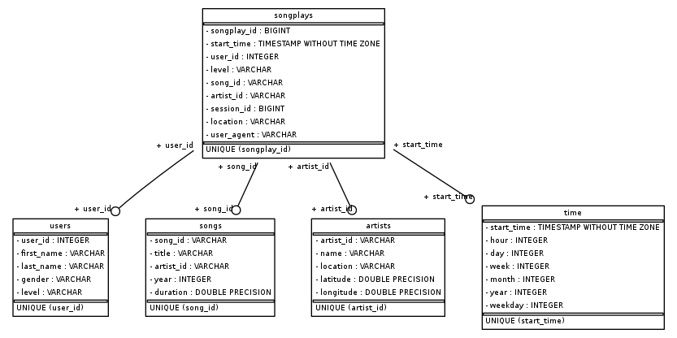

# Data Lake with Spark

## About The Project

This project creates a Data Lake in S3 for the Sparkify mock music streaming app. The original data consists of song and song play log data.

## Data Lake Schema

The source data comes from log JSON files in the S3 bucket of the application. These files are copied into staging tables in redshift and after a insert is done from the staging into the final tables of the Data Warehouse. 

The final schema was design as a star schema to optimize queries of songplay data and song data as follows:



### Fact Table
`songplays`: long data from songs played in NextSong.
 - songplay_id, start_time, user_id, level, song_id, artist_id, session_id, location, user_agent

### Dimension Tables
`users`: users data.
- user_id, first_name, last_name, gender, level

`songs`: songs data.
- song_id, title, artist_id, year, duration

`artists`: artists data.
- artist_id, name, location, latitude, longitude

`time`: timestamp auxiliary table. 
- start_time, hour, day, week, month, year, weekday

## Getting Started

To run the project it is required a AWS user with privileges to read and write in S3. Also, the scripts to create and insert data in the tables are in Spark.

### Prerequisites

* AWS account
* Spark

### Configuration File

The user should create a `dl.cfg` file with the fields as exemplified below:

```
[AWS]
AWS_ACCESS_KEY_ID=your_access_key
AWS_SECRET_ACCESS_KEY=your_secret_access
```

## Usage

The user can execute the `etl.py` to read the source JSONs from the Udacity S3 bucket and save the data in the destination folder, hard coded in the `etl.py`. To run the script, it is important to set Spark to PySpark first as follows:

 ```sh
 PYSPARK_PYTHON=/usr/bin/python3
 ```
 ```sh
 spark-submit etl.py
 ```

## Files Description

- `etl.py`: execute script to read the files in the source S3 bucket and writes the parquet files in the output bucket. To change the destination bucket, it is necessary to change the `output_data` variable in the main call.
