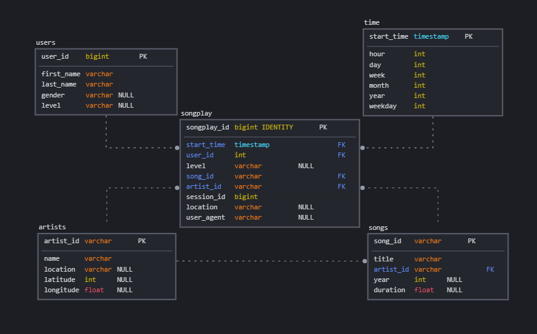

# Data Pipeline with Airflow

## About The Project

This project creates a Data Warehouse in Redshift for the Sparkify mock music streaming app optimized for data analytics with an Airflow Pipeline. This database consists of song and song play data in the schema below.

## Database Schema

The source data comes from log JSON files in the S3 bucket of the application. These files are copied into staging tables in redshift and after a insert is done from the staging into the final tables of the Data Warehouse. 

The final schema was design as a star schema to optimize queries of songplay data and song data as follows:

### Fact Table
`songplays`: long data from songs played in NextSong.
 - songplay_id, start_time, user_id, level, song_id, artist_id, session_id, location, user_agent

### Dimension Tables
`users`: users data.
- user_id, first_name, last_name, gender, level

`songs`: songs data.
- song_id, title, artist_id, year, duration

`artists`: artists data.
- artist_id, name, location, latitude, longitude

`time`: timestamp auxiliary table. 
- start_time, hour, day, week, month, year, weekday

## Getting Started

To run the project it is required a AWS user with privileges to insert data into the Redshift database. Also, the scripts to create and insert data in the tables are in Airflow.

### Prerequisites

* AWS account
* Airflow

### Airflow Connections

It is necessary to configure AWS and Redshift connection in Airflow in order to read data from S3 and load data to Redshift. Please refer to the [official website](https://airflow.apache.org/docs/apache-airflow/stable/howto/connection.html) to manage connections in Airflow.

One can use the default `Amazon Web Services` to connect to AWS in Airflow by providing Login (key) and Password (key secret) credentials of a user. The Redshift hook also has a default connection in Airflow namely `Postgres`. Please, name the connection id as `aws_credentials` for AWS and `redshift` for the Redshift.

## Usage

This repository does note includes the Airflow installation and environment configuration. To install Airflow, please refer to the official [website](https://airflow.apache.org/docs/apache-airflow/stable/installation/index.html).
The Airflow pipeline considers that the tables are already created in the Redshift database. If they are not, the user can run the queries in `airflow/create_tables.sql` to drop all previous project tables and create them. 
Later, the user can turn on the Airflow DAG `sparkify_dag` to insert the data into the staging tables and final tables. It is important to configure the connections to be able to connect to the Redshift and S3.

### Data Quality Check

The Airflow DAG final step is a data quality check to make sure that the pipeline has inserted correct data without errors. For simplicity, this process checks if the loaded tables has any row and if the primary key for each table is not null.

If the project requires, one can add new queries to the `subdag_check_data.py` to perform more robust tests. The only requirement is that the quality check query returns in the positive scenario True or a number greater than 0.

## Pipeline Description

The pipeline is programed to perform tasks to read the source data in S3, load this data in staging tables, create dimension and fact tables form the stage and perform data quality check, according to the image below.

Each box in the image is described below:

- `Begin_execution`: dummy task to define the start of the pipeline.
- `Stage_events`: loads data from a S3 bucket to the staging_events table in Redshift.
- `Stage_songs`: loads data from a S3 bucket to the staging_songs table in Redshift.
- `Load_songplays_fact_table`: creates the songplays table from the stage.
- `Load_song_dim_table`: creates the songs table from the stage. It is configured to delete records that follows `delete_from_column=`.
- `Load_user_dim_table`: loads data from a S3 bucket to the users table in Redshift. If the user desires, it is possible to delete all records from the table that matches a given column specified by `delete_from_column`.
- `Load_artist_dim_table`: loads data from a S3 bucket to the artists table in Redshift. If the user desires, it is possible to delete all records from the table that matches a given column specified by `delete_from_column`.
- `Load_time_dim_table`: loads data from a S3 bucket to the time table in Redshift. If the user desires, it is possible to delete all records from the table that matches a given column specified by `delete_from_column`.
- `Run_data_quality_checks`: SubDAG to perform data quality check in the end of the process.
- `End_execution`: dummy task to define the end of the pipeline.

### DAG Configuration

The DAG is configurated as follows and can be changed if one desires:

- `schedule_interval`: "0 * * * *" (hourly)
- `start_date`: datetime.now() - timedelta(days=1)
- `retries`: 2
- `retry_delay`: 5 minutes
- `depends_on_past`: False
- `catchup_by_default`: False
- `email_on_retry`: False
- `max_active_runs`: 1