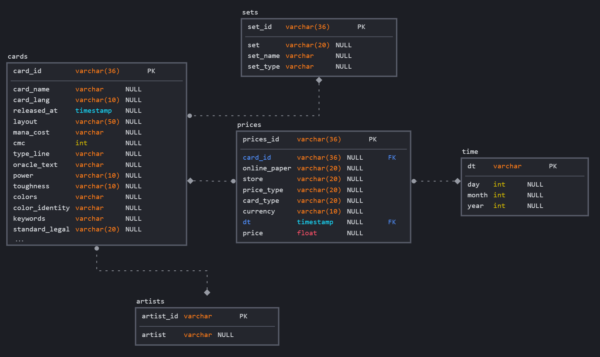
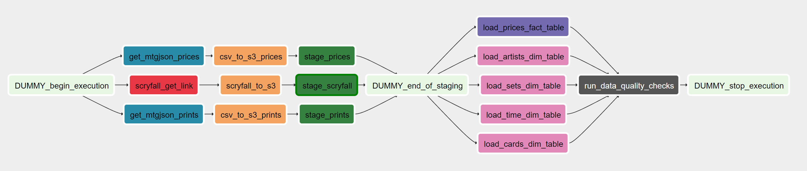
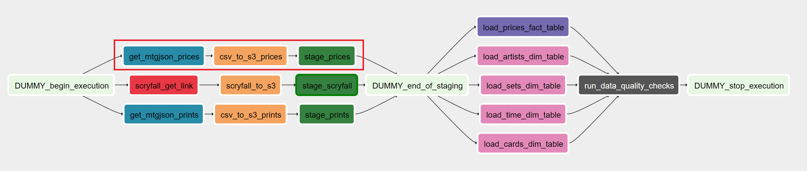
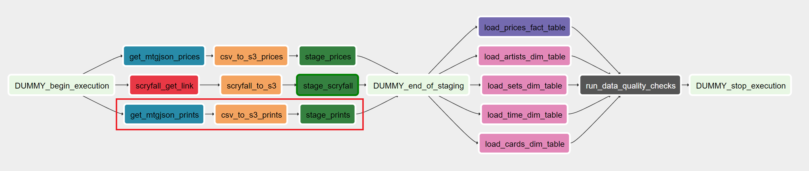
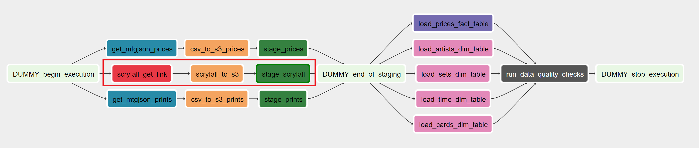
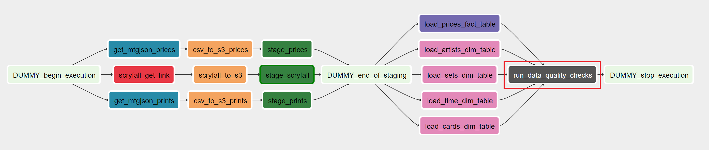

# Magic DB

## Data Engineering Capstone Project

### Project Summary

Magic: The Gathering (MTG) is a popular card game from the 90s that has a solid fan base and active trading card community. The game competitiveness and complexity attracts fans all around the world, creating a high demand for cards in the market.

The card trading market for MTG is complex given that number of players, the geographical spread of the game and the professional scenario. Even the construction of a new deck by the fan base can sky rocket the price of a single card within a day. In addition, official cards are released seasonally and many game stores buy and sell MTG products to casual or professional players making card prices volatile.

In the following sections we will explore the data and explain the steps taken.

### Scope
This project proposes the construction of a Magic database with card dimensional data and the prices that changes every day. This information is gathered and optimized for a fictional Data Science team to utilize in order to predict card prices in the next days. 

To accomplish this, we created an Airflow pipeline that extract the data from public hosts [Scryfall](https://scryfall.com) and [MTGJSON](https://mtgjson.com), creates the source datasets for the project, load the dataset into staging tables in Redshift and finally populates the dimension and fact tables in a star schema also in Redshift. The schema is created to optimize card price queries.

### Describe and Gather Data
In this project, we will collect data from two distinct sources:

- [Scryfall](https://scryfall.com): following the [guidelines](https://scryfall.com/docs/api) of [MTG policy](https://company.wizards.com/en/legal/fancontentpolicy) this site provides an API to search MTG cards and detailed information, even the card images are available to request. In this project, we will request programmatically the [bulk data](https://scryfall.com/docs/api/bulk-data) with all the card.

- [MTGJSON](https://mtgjson.com): for the card prices, we resource to MTGJSON that provides a download link to all card prices that they collect from major stores in Europe and United States. Their guidelines and licensing are available [here](https://github.com/mtgjson/mtgjson).

> **NOTE:**
This is a unofficial project for academic purpose only and should not be used for monetary gain. It is not funded or endorsed by any company.

### The Data Model
#### Conceptual Data Model

We propose a Snowflake schema with the following design:



We have 4 dimension tables and one fact. Here are the description of each table (please refer to 4.3 for each field description):

##### Fact Table
`prices`: fact table with card prices by date. The prices can be for online or paper MTG.
 - prices_id, card_id, online_paper, store, price_type, card_type, currency, dt, price

##### Dimension Tables
`sets`: information about the set of the card. Each card belongs to only one set.
- set_id, set, set_name, set_type

`artists`: artists that create the art of the card. The card can have more than one artist.
- artist_id, artist

`time`: auxiliary time table.
- dt, day, month, year

`cards`: information of all cards in MTG. Each card is a single row, even if there is the same card in a different language.
- card_id, card_name, card_lang, released_at, layout, mana_cost, cmc, type_line, oracle_text, power, toughness, colors, color_identity, keywords, standard_legal, pioneer_legal, modern_legal, legacy_legal, historic_legal, reserved, foil, nonfoil, oversized, promo, reprint, variation, set_id, collector_number, digital, rarity, artist_ids, border_color, frame, full_art, textless, booster, story_spotlight, printed_name, printed_type_line, printed_text, security_stamp, loyalty, watermark, produced_mana, color_indicator, content_warning, life_modifier, hand_modifier

##### Data Dictionary

Please refer to `Data Dictionary.md` to the description of each field in the database.

## Getting Started

The project is run in Airflow. It is important to configure Airflow as follows:

- `Airflow Version: 1.10.9`

- Create Connections:

    Scryfall: 
    ```
    Conn Id: scryfall_api
    Conn Type: HTTP
    Host: https://api.scryfall.com
    ```

    AWS:
    ```
    Conn Id: aws_credentials
    Conn Type: Amazon Web Services
    Login: your_user_access_key
    Password: your_user_secret_access_key
    ```

    Redshift:
    ```
    Conn Id: redshift
    Conn Type: Postgres
    Host: your_endpoint
    Schema: your_schema
    Login: your_user
    Password: your_user_secret
    Port: 5439
    ```
    
- Create Variable:

    S3 Bucket: 
    ```
    name: s3_bucket
    value: your_bucket_name

- Install libraries if not in the environment
    ``` sh
    pip install boto3
    pip install pandas
    ```

In AWS save the `scryfall_json_path.json` in the bucket root or add it to a Variable.

## Usage

This repository does not includes the Airflow installation and environment configuration. To install Airflow, please refer to the official [website](https://airflow.apache.org/docs/apache-airflow/stable/installation/index.html).

The Airflow pipeline considers that the tables are already created in the Redshift database. If they are not, the user can run the queries in `airflow/create_tables.sql` to drop all previous project tables and create them. 

Later, the user can turn on the Airflow DAG `mtg_db` to insert the data into the staging tables and final tables. It is important to configure the connections to be able to connect to the Redshift and S3.

## Pipeline Description



The pipeline can be separated in 3 main steps. First we download the data from the sources, transform it and load into the Redshift. Then, we load the dimension and fact tables. Finally, we run data checks to ensure quality of the final tables. Lets have a look at each step.

##### Step 1.1



We get the MTGJSON price data from the ALLPrices link. Transform it into a CSV table with all prices and send to Redshift stage table `staging_prices`.

##### Step 1.2



The same is done to prints with the ALLPrints link. This table holds the card name and set of prices and will allow us to JOIN the dimension tables from Scryfall. The Redshift stage table is `staging_prints`.

##### Step 1.3



For the Scryfall data, first we request the API for the bulk-data link and then we download the JSON and COPY it to Redshift in the `staging_scryfall` stage table.

##### Step 2


After we load the staging tables, we perform ETL on it to create the dimension and fact tables.

##### Step 3



Finally, the a quality check is run in the final tables to ensure quality of the data loaded. 